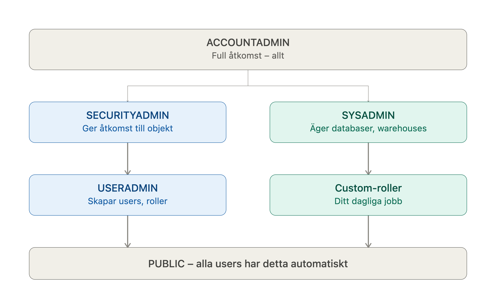

# Snowflake – Lathund för roller & access control
 
## De inbyggda systemrollerna
 
### 🔑 ACCOUNTADMIN
**Toppen av hierarkin.** Har alla rättigheter i hela kontot.
 
- Kan göra *allt* – skapa/ta bort users, roller, warehouses, databaser
- Hanterar fakturering och kontoinställningar
- **Använd bara för:** initial setup, akuta situationer, eller om du är ensam admin på ett litet konto
- ⚠️ Undvik att köra vardaglig utveckling som ACCOUNTADMIN – för mycket makt för att vara "default"-rollen
---
 
### 👤 USERADMIN
**Hanterar users och roller** (men inte data eller warehouses).
 
Använd USERADMIN när du ska:
- Skapa nya users (`CREATE USER`)
- Skapa nya roller (`CREATE ROLE`)
- Tilldela roller till users (`GRANT ROLE ... TO USER ...`)
- Ändra lösenord, låsa/låsa upp users
❌ Kan **inte** ge rättigheter på databaser/tabeller till roller – det är SECURITYADMINs jobb (om inte USERADMIN själv fått den behörigheten via grant).
 
---
 
### 🔒 SECURITYADMIN
**Hanterar säkerhet och åtkomst** – ärver allt USERADMIN kan göra, plus mer.
 
Använd SECURITYADMIN när du ska:
- Ge rättigheter till roller på databaser/scheman/tabeller (`GRANT SELECT ON ... TO ROLE ...`)
- Skapa/hantera nätverkspolicys
- Hantera övergripande access-styrning i kontot
Tumregel: **USERADMIN skapar identiteter, SECURITYADMIN ger dem åtkomst.**
 
---
 
### ⚙️ SYSADMIN
**Hanterar objekt** – databaser, scheman, tabeller, warehouses.
 
Använd SYSADMIN när du ska:
- Skapa databaser, scheman, tabeller (`CREATE DATABASE`, `CREATE SCHEMA`, `CREATE TABLE`)
- Skapa/hantera warehouses (`CREATE WAREHOUSE`)
- Detta är rollen du oftast vill ha som **förälder** till dina egna custom-roller (t.ex. `DATA_ENGINEER`, `ANALYST`) så att SYSADMIN alltid har överblick över allt som skapas
---
 
### 🌐 PUBLIC
**Alla users tillhör automatiskt PUBLIC.**
 
- Används för rättigheter som *alla* i kontot ska ha
- I praktiken ofta tom/minimal – undvik att lägga känsliga rättigheter här
---
 
## Custom-roller (det du oftast jobbar med i vardagen)
 
I praktiken skapar man egna roller för olika team/funktioner, t.ex:
 
| Roll | Typiskt ansvar |
|---|---|
| `DATA_ENGINEER` | Ladda/transformera data, skapa tabeller i staging |
| `ANALYST` | Läsa data, köra queries, bygga dashboards |
| `DBT_ROLE` / `PIPELINE_ROLE` | Köra automatiserade pipelines (som ditt dlt-script) |
 
Dessa roller skapas av **USERADMIN**, får sina rättigheter av **SECURITYADMIN**, och bör ofta ärva från/vara kopplade under **SYSADMIN** i hierarkin så att SYSADMIN har full insyn.
 
---
 
## Snabb beslutsguide – "Vilken roll ska jag byta till?"
 
| Jag vill... | Använd roll |
|---|---|
| Skapa en ny kollega som user | `USERADMIN` |
| Skapa en ny roll (t.ex. `DATA_ENGINEER`) | `USERADMIN` |
| Ge en roll rätt att läsa/skriva i en tabell | `SECURITYADMIN` |
| Skapa en ny databas eller schema | `SYSADMIN` |
| Skapa/skala ett warehouse | `SYSADMIN` |
| Köra din dagliga pipeline/dlt-script | Din egna custom-roll (t.ex. `DATA_ENGINEER`), **inte** ACCOUNTADMIN |
| Nödläge / du vet inte vem som har rätt roll | `ACCOUNTADMIN` (men bara tillfälligt!) |
 
---
 
## Best practice att komma ihåg
 
1. **Kör aldrig vardagsarbete som ACCOUNTADMIN.** Skapa en custom-roll (t.ex. `DATA_ENGINEER`) och använd den för dina script/pipelines – precis som din `load_job_ads.py` bör köras under en roll med bara de rättigheter den faktiskt behöver.
2. **Separation of duties:** USERADMIN skapar *vem*, SECURITYADMIN bestämmer *vad de får göra*, SYSADMIN äger *objekten*.
3. Dina egna roller (som `DATA_ENGINEER`) bör normalt vara kopplade till `SYSADMIN` i rollhierarkin, så att SYSADMIN alltid ser och kan hantera allt som skapas i kontot.
4. Byt roll i en session med:
```sql
   USE ROLE SECURITYADMIN;
```
 
