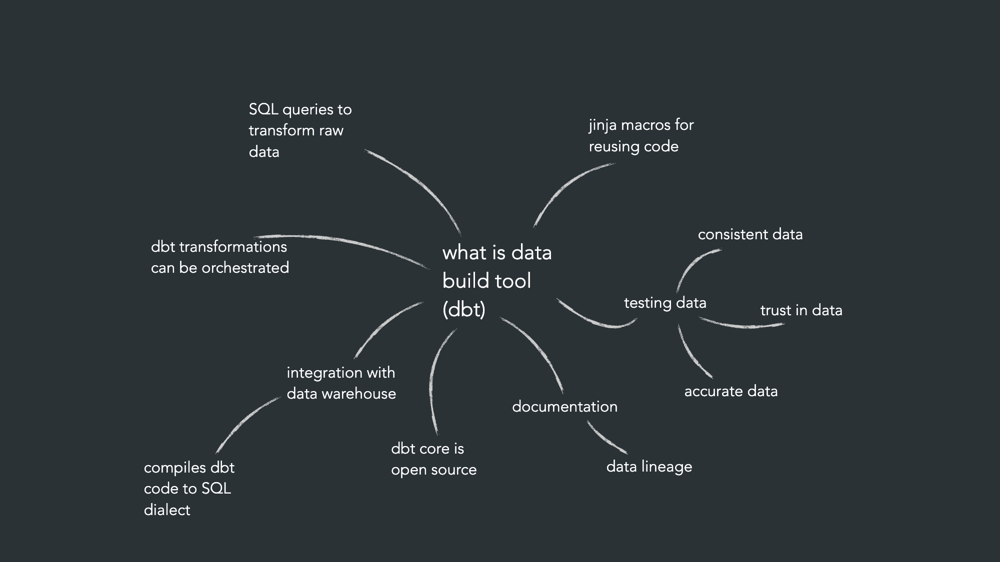

# DBT (data build tool)

## What is DBT?



## Initiating project for dbt

```
dbt init {name of project ex dbt_code}
```

## If its not the first time working with dbt this will come up:

```
(data-warehouse-lifecycle) mirandalyng@MacBook-Air-som-tillhor-Miranda 09_setup_dbt % dbt init dbt_code
11:27:35  Running with dbt=1.12.5
11:27:36  Setting up your profile.
The profile dbt_code already exists in /Users/mirandalyng/.dbt/profiles.yml. Continue and overwrite it? [y/N]:
```

- both y/N will continue the project
- If you dont want to overwrite choose N

## Two locations that are populated by dbt

### Navigate to dbt folder

Stores the credentials in .dbt

Mac:

```
cd ~/.dbt
```

PowerShell :

```
C:\Users\{din_user}\.dbt
```

```
ls to see .dbt to see profiles.yml
```

open the yml file with credentials

```
open profiles.yml
```

## dbt_code files

### Git ignore and readme

- Put the git ignore from dbt in your own
- Delete the readme and gitignore for more stucture

### Models

- example files
- corresponding to the dbt transformation

### Seeds

- dbt run (the dbt will not go through this when you do the transformation)

### Snapshots

- describe some tables that you want to capture at some point at a time
- remove it

### dbt_project.yml — Project Configuration File

- Think of dbt_project.yml as the control center for your dbt project.

- This is the core configuration file of your dbt project.

#### Key Responsibilities

- Defines project name and version
- Controls model materializations
- Applies folder-level configurations
- Sets schema and database behavior

**profile:**

- you cant have multiple profile.yml in the computer
- No (keep the original file )
- Yes (replace the profiles.yml)

### You can have several profiles in the profiles.yml

- put the profile name in the dbt_projects.yml file

```
profile: '{profile_name}'
```

- if you change the folder names in the dbt init files you need to change it in the dbt_projets.yml

```
EX:
model-paths: ["models"] <-- change here
```

Models

```
models:
add folders you put here to the dbt_projects.yml
```
