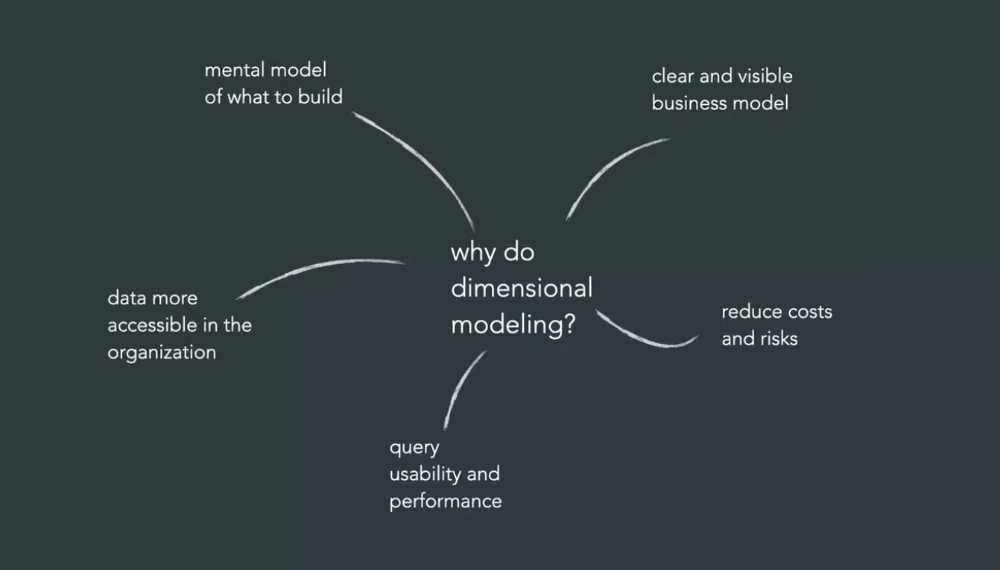
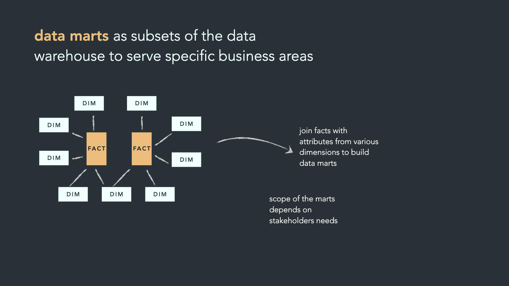

# Dimensional Modeling

## Why do dimentional modeling ?

- Easy to understand
- Less join
- Faster

## Layers in pipeline

1. **Different data sources** – Olika datakällor kommer in: dokument/filer, webb/applikationsdata (laptop-ikonen) och nätverks-/API-data (nod-nätverket längst ner).
2. **Staging** – Data landar först här i mer eller mindre rått format, innan den bearbetats eller transformerats.
3. **Warehouse** (highlightad) – Här struktureras och konsolideras datan till en central, "sanningsenlig" datamodell. Det här är kärnan i pipelinen: data rensas, normaliseras och lagras på ett sätt som gör den återanvändbar för flera syften.
4. **Mart** – Från warehouse-lagret bryts datan ut i mindre, mer specialiserade "data marts" (de tre mindre rutorna) – ofta anpassade för specifika team eller användningsområden (t.ex. sälj, marknad, finans).
5. **Dashboard** – Slutligen konsumeras datan i ett BI-verktyg/dashboard ("cool board") för visualisering och analys.

## Star schemas

### Data marts som subset av data warehouse

- **Vad är en data mart?** En mindre, avgränsad del av data warehouse som är skräddarsydd för ett specifikt affärsområde (t.ex. sälj, marknad, ekonomi).

- **FACT-tabeller** – innehåller mätvärden/händelser (t.ex. antal sålda produkter, intäkter, transaktioner).

- **DIM-tabeller (dimensioner)** – innehåller beskrivande attribut som ger kontext åt fakta (t.ex. kund, produkt, tid, plats).

- **Hur en data mart byggs:** Man **joinar** (kopplar ihop) fact-tabeller med relevanta dimension-tabeller för att skapa en datamängd anpassad för ett specifikt syfte eller team.

- **Omfattningen (scope) av en mart** bestäms av vad stakeholders faktiskt behöver – man tar bara med de dimensioner och fakta som är relevanta för just den gruppen, inte allt som finns i warehouse.

**Kort sagt:** Data warehouse är den stora, centrala datamängden – data marts är mindre, fokuserade "utsnitt" av den, byggda genom att koppla ihop fact- och dim-tabeller efter behov.

## 4 steps of dimensional modeling

1. **Find the business process** (Hitta affärsprocessen)
   Identifiera _vilken_ affärsprocess eller aktivitet som ska mätas och analyseras – t.ex. försäljning, orderhantering eller lagerhantering (symboliseras av shoppingvagnen).

2. **Define the grain** (Definiera granulariteten)
   Bestäm exakt _vad en rad i fact-tabellen representerar_ – t.ex. "en radpost per order" eller "en transaktion per kund och dag". Detta är avgörande eftersom det styr detaljnivån i all analys.

3. **Identify the dimensions** (Identifiera dimensionerna)
   Bestäm _kontexten_ runt varje faktum – vem, vad, var, när, hur (t.ex. kund, produkt, butik, tid). Dessa blir DIM-tabellerna.

4. **Identify the facts** (Identifiera fakta)
   Bestäm _vilka mätvärden_ som ska lagras – de numeriska värden man vill summera eller analysera (t.ex. antal sålda enheter, intäkt, kostnad).
