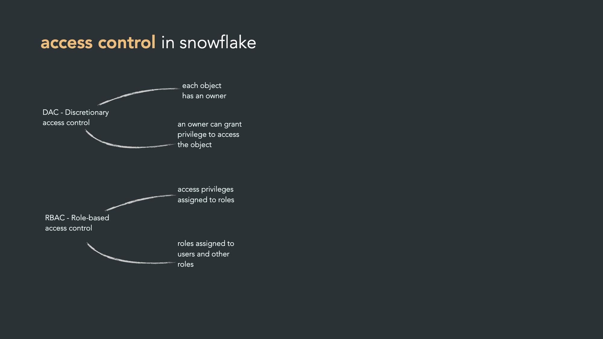
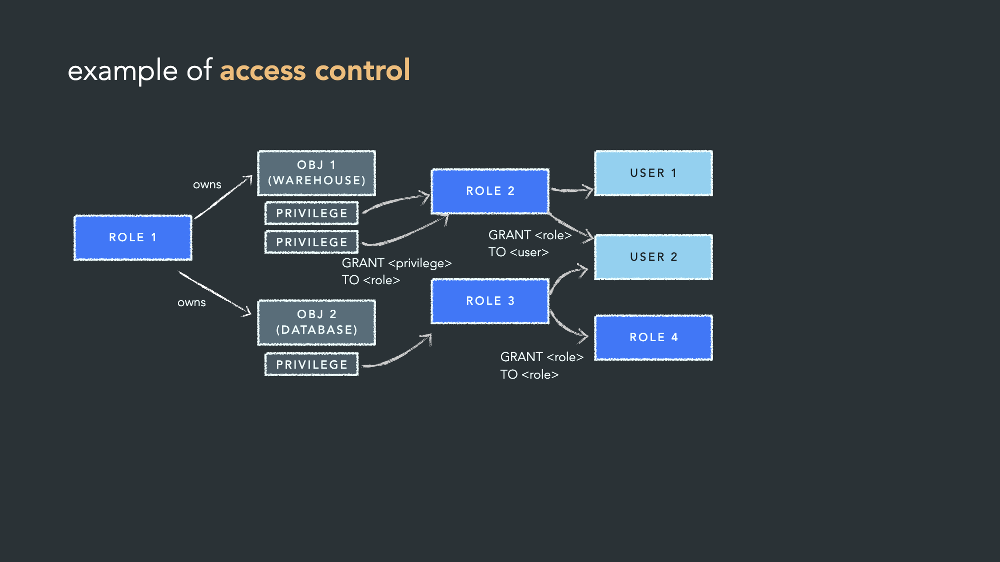
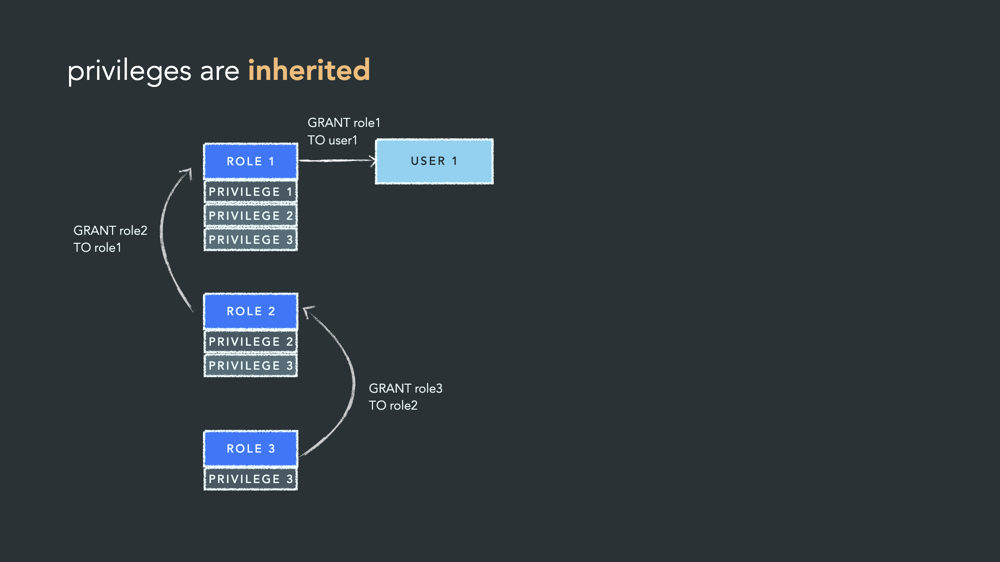
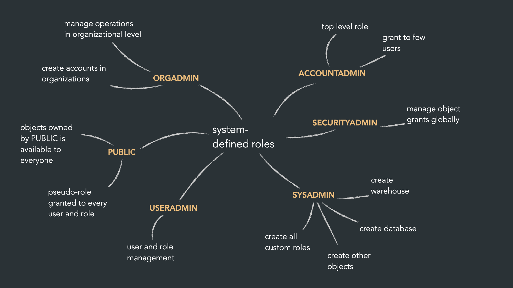
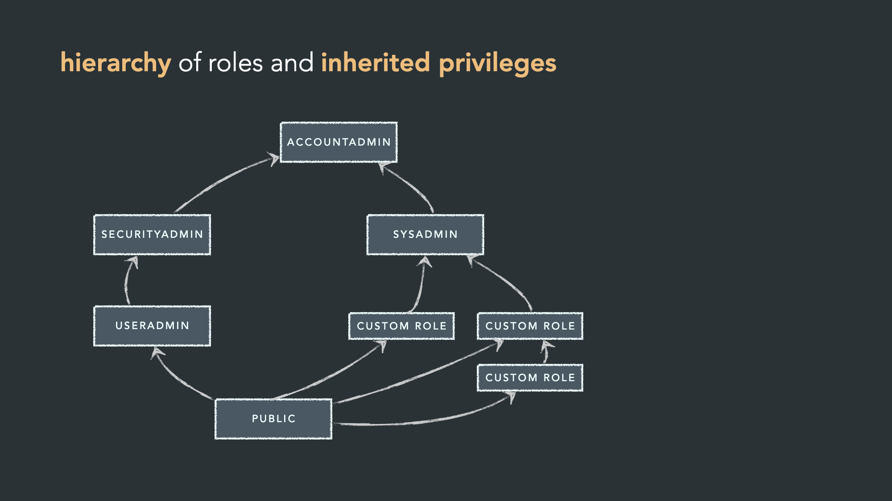

# Snowflake Role Hierarchy

## USER & ROLE

**User (användare)**
En user representerar en person eller tjänst som faktiskt loggar in i Snowflake — t.ex. mirandalyng eller extract_loader från era tidigare skript. En user har inloggningsuppgifter (lösenord, key-pair, SSO osv) och identifierar vem som ansluter.

**Role (roll)**
En role är ett behörighetspaket — en samling rättigheter (privileges) som styr vad man får göra, t.ex. SELECT på en tabell, USAGE på ett warehouse, CREATE TABLE i ett schema. En roll äger inte inloggningsuppgifter och kan inte logga in själv.

**Hur de hänger ihop**
En user har ingen makt att göra något i Snowflake förrän den tilldelats en eller flera roller:

```
GRANT ROLE movies_dlt_role TO USER extract_loader;
```

Och rollen i sig får sina rättigheter genom GRANT-satser:

```
GRANT USAGE ON WAREHOUSE dev_wh TO ROLE movies_dlt_role;
GRANT SELECT ON ALL TABLES IN SCHEMA movies.staging TO ROLE movies_dlt_role;
```

## Access Control in snowflake



## Example of access control



- privileges are inherited
- role 1 grants the role1 to user1
- you can grant role2 to role1
- and role3 to role2



## System-defined roles



- you should use lowest ranking role that can do the task

## Hierarchy of roles and inherited privilages



**Sysadmin**

- creating warehouse and databases
