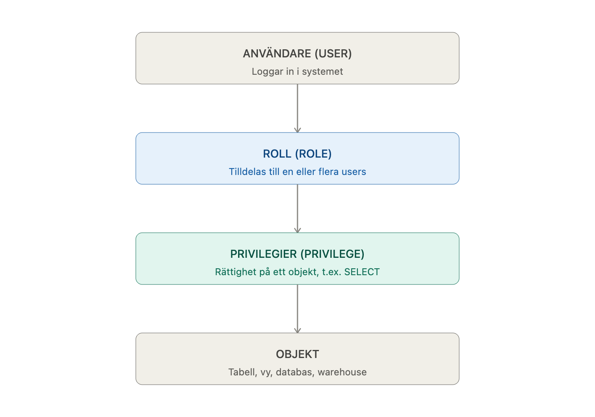

# User and Roles in Snowflake Lecture 16/9

## Teori

### Vem och Vad

- Collaborate and manage security with user and roles
  - _vem_ är du och _vad_ kan du göra? (Access control)
  - Authentication (**vem**)

### Hierachy of _securable objects_

Organization --> account --> (warehouse, database, role, user, other acc_obj)

### Access control in Snowflake

- DAC - Discretionary access control
  - each object has a owner
  - an owner can grant priviliage to access the object

- RBAC - Role based access control
  - access privilages assigned to roles
  - roles assigned to user and other roles

- Learnpoint exempel
  - users (studenter, lärare, utbildningsledare ) - alla är users som får använda learnpoint
  - Olika roller (Lärare, UL , studenter) - olika roller
  - De olika rollerna har olika permissions
    - UL - permission to add student info, add courses
    - Student - permission to submit homework
    - Lärare - permission to upload homework, grade

### USER -> ROLE -> PRIVILEGE

- **I snowflake heter det privilage**

- **Scalebility is more useful if the privelige is assigned to a role and not to the user** (manage different users)

## Roles & usage

### ORGADMIN (organization admin)

- manage operations in organizational level
- create accounts in organizations

### ACCOUNTADMIN

- top level role
- grant to few users

### SECURITYADMIN

- manage objects grants globally
- even if he or she doesnt own the object they can grant it to other
- they can't use the object but grant manage to other roles

### SYSADMIN

- create warehouses, databases, create other objects

### USERADMIN

- create all custom roles
- user and role mangagment

### PUBLIC

-

## Hierachy of roles and inherited privileges

EXEMPEL

| ROLE           | Privilege              |
| -------------- | ---------------------- |
| account admin  | bills, credit payments |
| sysadmin       | manage object          |
| user admin     | create users and roles |
| security admin | grant manager          |
